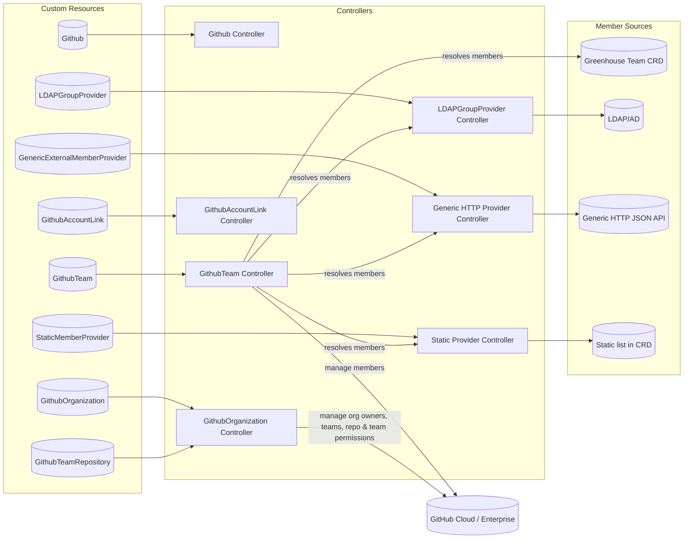
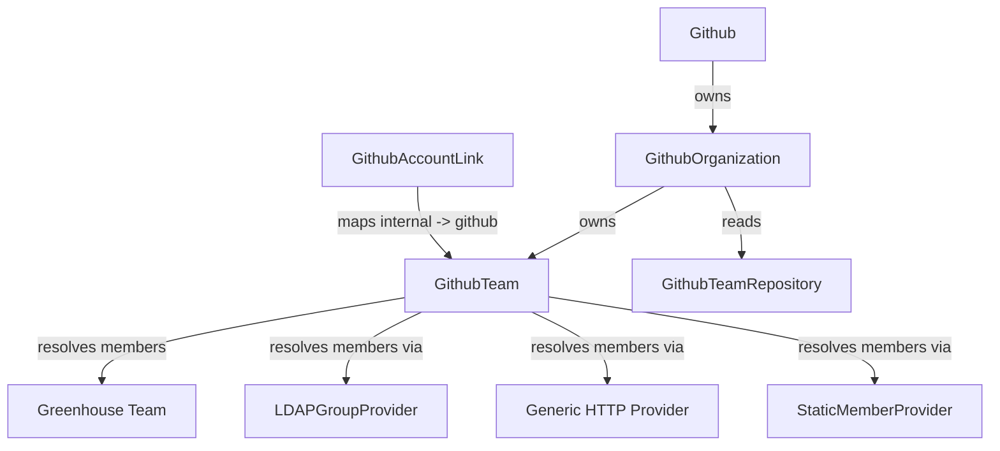
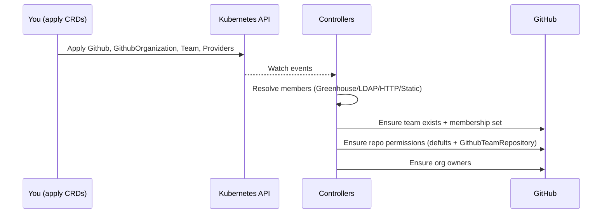

[](https://api.reuse.software/info/github.com/cloudoperators/repo-guard)

# Repo Guard

Repo Guard automates GitHub organization management using Kubernetes Custom Resources (CRDs).

It reconciles teams, team memberships, repository permissions, and organization ownership, sourcing members from pluggable providers (Greenhouse, LDAP, HTTP, Static, etc.).

## Architecture




## Custom Resources Overview

The operator defines the following CRDs (all under apiVersion: githubguard.sap/v1):

Note:
- [`Github`](api/v1/github_types.go): Connection to a GitHub App installation (base URL, API URL, app ID, secret).
- [`GithubOrganization`](api/v1/githuborganization_types.go): Represents a GitHub organization scoped to a `Github` resource; exposes action flags via labels to enable/disable operations.
- [`GithubTeam`](api/v1/githubteam_types.go): Desired GitHub team with a member provider. A `GithubTeam` supports exactly one team membership source at a time. By design, this plugin is created to read team memberships from Greenhouse but external member providers are also available.
- [`GithubTeamRepository`](api/v1/githubteamrepository_types.go): Overrides/exception list for repository-to-team permission assignments.
- [`GithubAccountLink`](api/v1/githubaccountlink_types.go): Maps an internal user identity (e.g., employee ID) to a GitHub user ID and handles multi-organization email verification.
- [`LDAPGroupProvider`](api/v1/ldapgroupprovider_types.go): External member provider resolving members from LDAP/AD groups.
- [`GenericExternalMemberProvider`](api/v1/genericexternalmemberprovider_types.go): External member provider fetching members from an arbitrary HTTP endpoint.
- [`StaticMemberProvider`](api/v1/staticmemberprovider_types.go): Inline static member list.


## Resource Relationships



## How Reconciliation Works




## End‑to‑End Walkthrough

1. Create a [`Github`](api/v1/github_types.go) resource for your GitHub App installation:
   ```yaml
   apiVersion: githubguard.sap/v1
   kind: Github
   metadata:
     name: com
   spec:
     webURL: https://github.com
     v3APIURL: https://api.github.com
     integrationID: 420328
     clientUserAgent: greenhouse-github-guard
     secret: github-com-secret
   ```

2. Define the [`GithubOrganization`](api/v1/githuborganization_types.go) with required spec and enable actions with labels:
   ```yaml
   apiVersion: githubguard.sap/v1
   kind: GithubOrganization
   metadata:
     name: com--greenhouse-sandbox
     # namespace: default
     labels:
       githubguard.sap/addTeam: "true"
       githubguard.sap/removeTeam: "true"
       githubguard.sap/addOrganizationOwner: "true"
       githubguard.sap/removeOrganizationOwner: "true"
       githubguard.sap/addRepositoryTeam: "true"
       githubguard.sap/removeRepositoryTeam: "true"
       githubguard.sap/dryRun: "false"
   spec:
     github: com
     organization: greenhouse-sandbox
     organizationOwnerTeams:
     - org-admins
     defaultPublicRepositoryTeams:
     - team: public-pull-team
       permission: pull
     - team: public-push-team
       permission: push
     - team: public-admin-team
       permission: admin
     defaultPrivateRepositoryTeams:
     - team: private-pull-team
       permission: pull
     - team: private-push-team
       permission: push
     - team: private-admin-team
       permission: admin
     installationID: 43715277
   ```

3. Create member providers and then you can refer to them in `GitHubTeam` resources:
    - [`LDAPGroupProvider`](api/v1/ldapgroupprovider_types.go):
    ```yaml
    apiVersion: githubguard.sap/v1
    kind: LDAPGroupProvider
    metadata:
      name: engineering-ldap
    spec:
      host: ldap.example.com:636
      baseDN: dc=example,dc=com
      secret: ldap-bind-secret
    ```
   Secret for LDAP bind:
    ```yaml
    apiVersion: v1
    kind: Secret
    metadata:
      name: ldap-bind-secret
    stringData:
      bindDN: "cn=bind,dc=example,dc=com"
      bindPW: "super-secret"
    ```

    - [`GenericExternalMemberProvider`](api/v1/genericexternalmemberprovider_types.go) (HTTP):
    ```yaml
    apiVersion: githubguard.sap/v1
    kind: GenericExternalMemberProvider
    metadata:
      name: http-eng
    spec:
      endpoint: https://api.example.com/members
      secret: http-cred
      resultsField: results
      idField: id
      paginated: true
      totalPagesField: total_pages
      pageParam: page
    ```
   Secret for HTTP provider:
    ```yaml
    apiVersion: v1
    kind: Secret
    metadata:
      name: http-cred
    stringData:
      username: "api-user"
      password: "api-pass"
    ```
    - [`StaticMemberProvider`](api/v1/staticmemberprovider_types.go):
    ```yaml
    apiVersion: githubguard.sap/v1
    kind: StaticMemberProvider
    metadata:
      name: static-seed
    spec:
      groups:
        - group: any
          members:
            - johndoe
            - janedoe
    ```

4. Define a `GithubTeam` and choose one membership source. Labels control add/remove operations:
  ```yaml
  apiVersion: githubguard.sap/v1
  kind: GithubTeam
  metadata:
    name: com--greenhouse-sandbox--eng
    labels:
      githubguard.sap/addUser: "true"
      githubguard.sap/removeUser: "true"
  spec:
    github: com
    organization: greenhouse-sandbox
    team: eng
    # Greenhouse (no externalMemberProvider)
    # greenhouseTeam: engineering

    # Alternative sources
    # Option A: LDAP group
    # externalMemberProvider:
    #   ldap:
    #     provider: engineering-ldap
    #     group: cn=eng,ou=groups,dc=example,dc=com

    # Option B: Generic HTTP provider via generic adapter
    # externalMemberProvider:
    #   genericHTTP:
    #     provider: http-eng
    #     group: results

    # Option C: Static members
    # externalMemberProvider:
    #   static:
    #     provider: static-seed
    #     group: any
  ```

5. Add exceptions/overrides with [`GithubTeamRepository`](api/v1/githubteamrepository_types.go):
  ```yaml
  apiVersion: githubguard.sap/v1
  kind: GithubTeamRepository
  metadata:
    name: com--greenhouse-sandbox--eng--overrides
  spec:
    github: com
    organization: greenhouse-sandbox
    team: eng
    repository:
      - greenhouse-secret
    permission: pull
  ```

6. Map internal identities to GitHub with [`GithubAccountLink`](api/v1/githubaccountlink_types.go):
  ```yaml
  apiVersion: githubguard.sap/v1
  kind: GithubAccountLink
  metadata:
    name: com-jdoe
  spec:
    userID: jdoe
    githubUserID: "2042059"
    github: com
  ```

## Labels reference

These labels control the behavior of the controllers. Unless specified otherwise, labels live under `metadata.labels` of the corresponding CRD instance.

GithubOrganization labels:

| Key | Allowed values | Description | Default |
| --- | --- | --- | --- |
| `githubguard.sap/addOrganizationOwner` | "true"/"false" | Allows the controller to add missing organization owners. If not set to "true", add operations are skipped. | Disabled (must be "true" to add) |
| `githubguard.sap/removeOrganizationOwner` | "true"/"false" | Allows the controller to remove extra organization owners. If not set to "true", remove operations are skipped. | Disabled (must be "true" to remove) |
| `githubguard.sap/addTeam` | "true"/"false" | Allows the controller to create missing teams defined by policy. | Disabled (must be "true" to add) |
| `githubguard.sap/removeTeam` | "true"/"false" | Allows the controller to remove teams that are out of policy. | Disabled (must be "true" to remove) |
| `githubguard.sap/addRepositoryTeam` | "true"/"false" | Allows setting default team permissions on repositories. | Disabled (must be "true" to add) |
| `githubguard.sap/removeRepositoryTeam` | "true"/"false" | Allows removing default team permissions from repositories. | Disabled (must be "true" to remove) |
| `githubguard.sap/dryRun` | "true"/"false" | When "true", no changes are made on GitHub; status shows planned operations. | "false" |
| `githubguard.sap/cleanOperations` | "complete"/"failed" | When in dryRun, set to "complete" to purge completed operations from status, or "failed" to purge failed ones. The label is removed automatically after cleanup. | Not set |
| `githubguard.sap/failedTTL` | Go duration (e.g., 1h, 30m) | Automatically clears failed operations and failed status after the duration since last status timestamp. | Not set |
| `githubguard.sap/completedTTL` | Go duration (e.g., 24h) | Automatically clears completed operations after the duration since last status timestamp. | Not set |

Note: GithubOrganization also supports the annotation `githubguard.sap/skipDefaultRepositoryTeams` to skip applying default team permissions on a comma-separated list of repositories.

GithubTeam labels:

| Key | Allowed values | Description | Default |
| --- | --- | --- | --- |
| `githubguard.sap/addUser` | "true"/"false" | Controls add member operations. If set to "false" the controller will skip adding users; if unset or "true" adds are allowed. | Allowed if unset; set "false" to disable |
| `githubguard.sap/removeUser` | "true"/"false" | Controls remove member operations. If set to "false" the controller will skip removing users; if unset or "true" removes are allowed. | Allowed if unset; set "false" to disable |
| `githubguard.sap/dryRun` | "true"/"false" | When "true", no member changes are made on GitHub; status shows planned operations. | "false" |
| `githubguard.sap/disableInternalUsernames` | "true"/"false" | When "true", members where GreenhouseID == GithubUsername are filtered out (avoids using internal IDs externally). | "false" |
| `githubguard.sap/require-verified-domain-email` | <domain> | When set, only members with a verified email under this domain (as reported in their `GithubAccountLink` multi-org results) are allowed. | Not set |
| `githubguard.sap/orphaned` | "true" | Informational label set by the controller when the team is considered orphaned. Do not set manually. | Not set (controller-managed) |
| `githubguard.sap/failedTTL` | Go duration | Clears failed operations and error after the duration since last status timestamp. | Not set |
| `githubguard.sap/completedTTL` | Go duration | Clears completed operations after the duration since last status timestamp. | Not set |
| `githubguard.sap/notfoundTTL` | Go duration | Clears operations in "notfound" state after the duration since last status timestamp. | Not set |
| `githubguard.sap/skippedTTL` | Go duration | Clears operations in "skipped" state after the duration since last status timestamp. | Not set |

GithubAccountLink labels & annotations:

| Key | Allowed values | Description | Default |
| --- | --- | --- | --- |
| `githubguard.sap/require-verified-domain-email` | <domain> | Legacy: Requests verification that the linked GitHub account has a verified email under the given domain. | Not set |
| `githubguard.sap/check-email-status` | "true"/"false" | Legacy: Set by the controller to indicate whether the user satisfied the verified-domain email requirement. | Controller-managed |
| `githubguard.sap/email-check-config` | JSON object | Multi-org email check configuration. See below for format. | Not set |
| `githubguard.sap/email-check-results` | JSON object | Multi-org email check results. Set by the controller. | Controller-managed |

### Multi-organization Email Verification

`GithubAccountLink` supports verifying GitHub account email addresses against specific domains for multiple organizations.

**Configuration (`githubguard.sap/email-check-config` annotation):**

```json
{
  "org-name": { "domain": "example.com", "enabled": true, "ttl": "24h" }
}
```

**Results (`githubguard.sap/email-check-results` annotation):**

```json
{
  "org-name": { "domain": "example.com", "verified": true, "timestamp": "2023-10-27T10:00:00Z" }
}
```

Additionally, the controller uses the following annotations for legacy or single-org check:
- `githubguard.sap/check-email-timestamp`: RFC3339 timestamp of the last email verification check
- `githubguard.sap/check-email-ttl`: Go duration defining how long the email verification result stays valid
- `githubguard.sap/skippedTTL`: Go duration defining how long a skipped user operation remains in status.


## Metrics & Monitoring

The controller exposes Prometheus metrics and includes a `ServiceMonitor` and example alerting rules. Custom business metrics are exported under the `repo_guard_*` namespace.

### Exported custom metrics

| Metric | Type | Labels | Description                                                                                                |
| --- | --- | --- |------------------------------------------------------------------------------------------------------------|
| `repo_guard_controller_reconcile_total` | Counter | `controller`, `result` | Total reconciliations by controller (e.g., `GithubTeam`) and result (`success`, `error`, `requeue`).       |
| `repo_guard_controller_reconcile_duration_seconds_bucket` (+ `_sum`, `_count`) | Histogram | `controller`, `le` | Reconcile durations.                                                                                       |
| `repo_guard_external_api_requests_total` | Counter | `provider`, `operation`, `status` | External API calls by provider (e.g., `external_generic_member_provider`), operation, and status category. |
| `repo_guard_external_api_request_duration_seconds_bucket` (+ `_sum`, `_count`) | Histogram | `provider`, `operation`, `le` | External API call durations.                                                                               |

### Suggested PromQL for dashboards

Basic activity:

```
sum by (controller) (rate(repo_guard_controller_reconcile_total[5m]))
```

Error rate per controller:

```
sum by (controller) (increase(repo_guard_controller_reconcile_total{result="error"}[10m]))
/
clamp_min(sum by (controller) (increase(repo_guard_controller_reconcile_total[10m])), 1)
```

Reconcile p50/p90/p95 duration (seconds):

```
histogram_quantile(0.5,  sum by (controller,le) (rate(repo_guard_controller_reconcile_duration_seconds_bucket[10m])))
histogram_quantile(0.9,  sum by (controller,le) (rate(repo_guard_controller_reconcile_duration_seconds_bucket[10m])))
histogram_quantile(0.95, sum by (controller,le) (rate(repo_guard_controller_reconcile_duration_seconds_bucket[10m])))
```

External API error rate per provider/operation:

```
sum by (provider,operation) (increase(repo_guard_external_api_requests_total{status!~"2.."}[10m]))
/
clamp_min(sum by (provider,operation) (increase(repo_guard_external_api_requests_total[10m])), 1)
```

External API latency p95:

```
histogram_quantile(0.95, sum by (provider,operation,le) (rate(repo_guard_external_api_request_duration_seconds_bucket[10m])))
```

No reconcile activity (per controller):

```
sum by (controller) (increase(repo_guard_controller_reconcile_total[30m]))
```

### Alerts

Alerting rules are provided in `config/prometheus/rules.yaml` and include:

- High/very high reconcile error rate
- Slow reconciles (p95)
- No reconcile activity
- External API high error rate and slow latency (p95)

## Support, Feedback, Contributing

This project is open to feature requests/suggestions, bug reports etc. via [GitHub issues](https://github.com/cloudoperators/repo-guard/issues). Contribution and feedback are encouraged and always welcome. For more information about how to contribute, the project structure, as well as additional contribution information, see our [Contribution Guidelines](CONTRIBUTING.md).

## Security / Disclosure
If you find any bug that may be a security problem, please follow our instructions at [in our security policy](https://github.com/cloudoperators/repo-guard/security/policy) on how to report it. Please do not create GitHub issues for security-related doubts or problems.

## Code of Conduct

We as members, contributors, and leaders pledge to make participation in our community a harassment-free experience for everyone. By participating in this project, you agree to abide by its [Code of Conduct](https://github.com/SAP/.github/blob/main/CODE_OF_CONDUCT.md) at all times.

## Licensing

Copyright 2025 SAP SE or an SAP affiliate company and repo-guard contributors. Please see our [LICENSE](LICENSE) for copyright and license information. Detailed information including third-party components and their licensing/copyright information is available [via the REUSE tool](https://api.reuse.software/info/github.com/cloudoperators/repo-guard).
