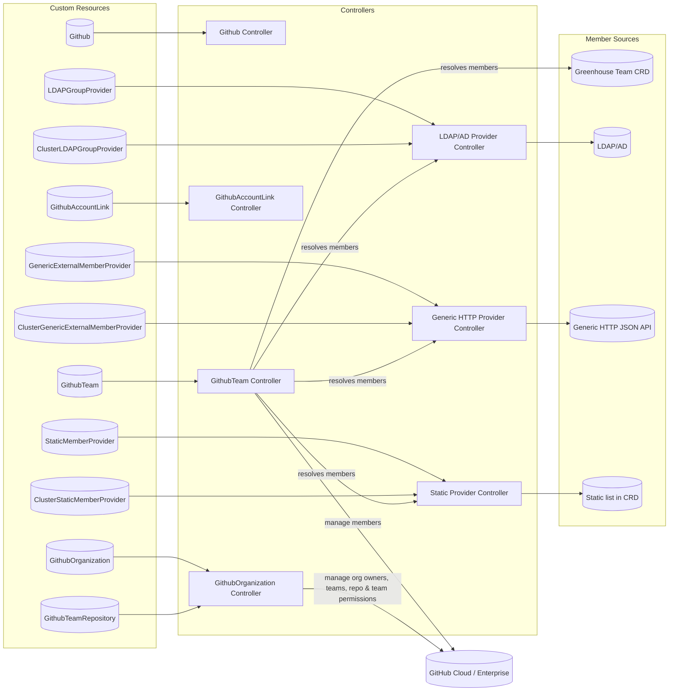
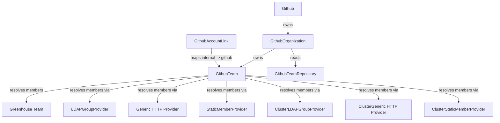
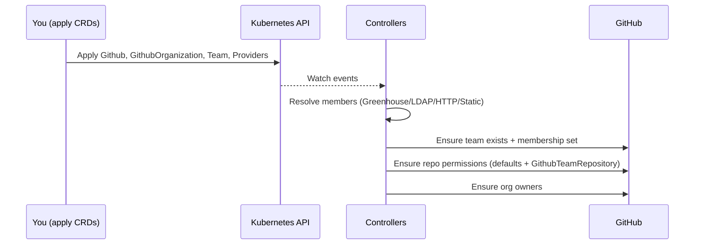

# Architecture

## System Overview

Repo Guard runs as a Kubernetes operator — a collection of controllers that each watch specific CRD types and reconcile desired state against GitHub's API.

## Resource Relationships

## How Reconciliation Works

## Controller Overview

| Controller | CRDs Watched | Responsibility |
|---|---|---|
| **Github** | `Github` | Validates GitHub App connectivity and surfaces status. |
| **GithubOrganization** | `GithubOrganization`, `GithubTeamRepository` | Manages org owners, team creation/deletion, default repo team permissions. |
| **GithubTeam** | `GithubTeam` | Resolves member list from a provider and syncs team membership on GitHub. |
| **GithubAccountLink** | `GithubAccountLink` | Maps internal user IDs to GitHub user IDs and performs email domain verification. |
| **LDAP Provider** | `LDAPGroupProvider`, `ClusterLDAPGroupProvider` | Periodically fetches group membership from LDAP/AD. |
| **Generic HTTP Provider** | `GenericExternalMemberProvider`, `ClusterGenericExternalMemberProvider` | Fetches member lists from a JSON HTTP API. |
| **Static Provider** | `StaticMemberProvider`, `ClusterStaticMemberProvider` | Serves an in-CRD static list; no external calls needed. |

## Rate Limiting & Backoff

When GitHub returns a rate-limit error the controller extracts the reset timestamp from the error message and requeues the resource with a `RequeueAfter` duration set to the reset time. This avoids busy-looping while still converging as soon as possible.

## Dry Run

Every mutable CRD supports the `repo-guard.cloudoperators.dev/dryRun: "true"` label. When set, the controller logs all intended operations and writes them to `.status` but makes no API calls to GitHub. This is useful for previewing the impact of a new policy before activating it.
